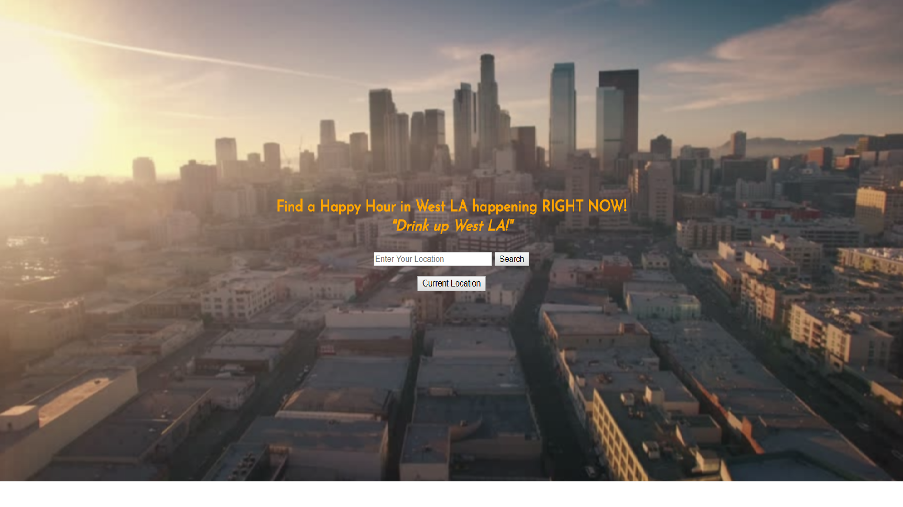
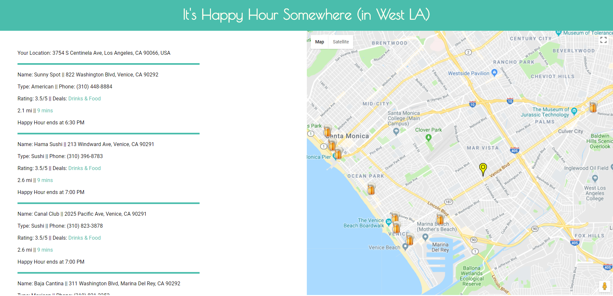

# Happy_Hour_Now_App
Thinkful Capstone Project #1

Happy Hour Now App
03.01.2018
 ─Eric Johnson Los Angeles, CA
 
Motivation
 
Have you ever said to your friends or loved one, “Hey let’s go get a quick drink (or bite)  at a Happy Hour” and then sat there for close to an hour searching the web looking for a place to get a drink or bite and end up being overwhelmed by the options and wasting an hour of your time or just give up?  Well no more my friend (as long as you live in West LA), this app streamlines this process into a matter of seconds.  Welcome to HHapp!
 

live 
https://yakamoose.github.io/Happy_Hour_Now_App/index.html
 
Overview
 
This app was invented for two reason, to save you time and money.  To do this the app streamlines the process of trying to find a local (only West LA right now) Happy Hour that is happening RIGHT NOW.  The app accepts the user’s location and then runs through the local bar and restaurant ‘database’ and returns establishments that are hosting a Happy Hour at the time of the search along with useful attributes to help the user make a quick choice, get to the bar, and get on with their life.

User Flow
 
User arrives at landing page and enters their address or clicks the current location.
The app then looks through its ‘database’ and returns a list of establishments that are CURRENTLY hosting a happy hour and places results on a map.
 
Technologies
 
HTML/CSS/Javascript/jQuery/Google Maps API/YELP API
